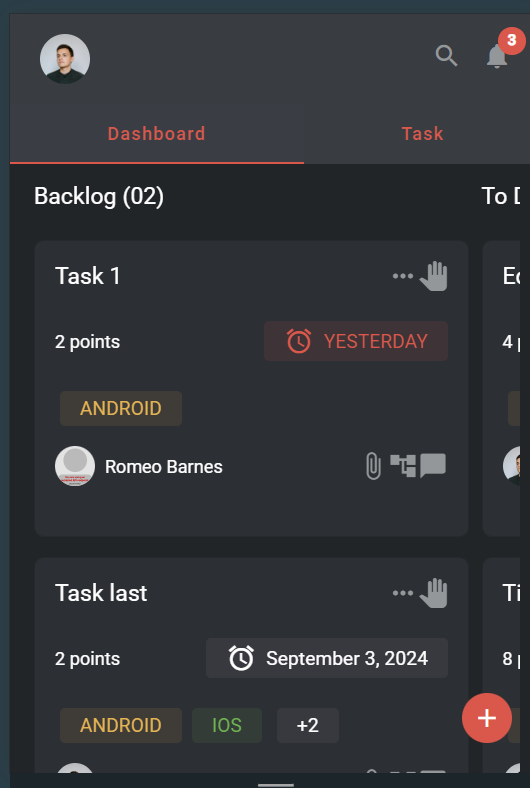
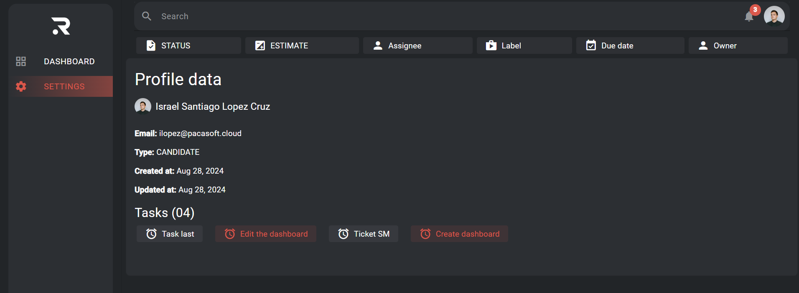
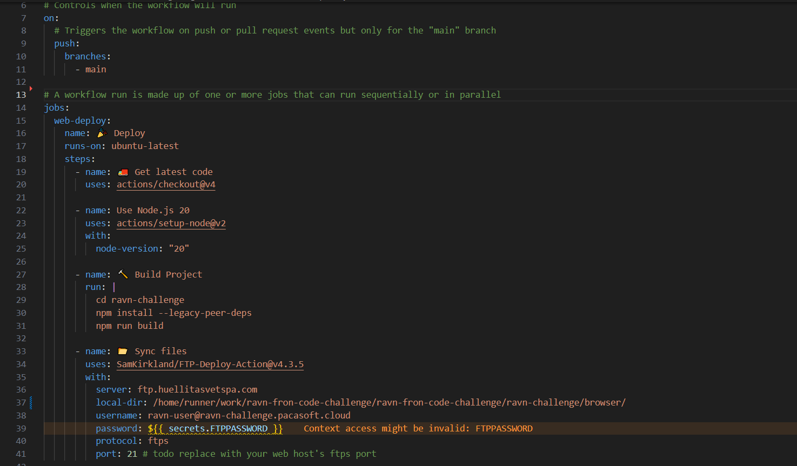

# Indice

- [Setup/Running instructions](#setuprunning-instructions)
- [Project description](#project-description)
- [Screenshots](#screenshots)
- [Technologies/Libraries](#technologieslibraries)
- [Decisitions](#decisitions)
- [Additional Info](#additional-info)
- [Demo](#demo)

Content of tables in broken because of emojis :triangular_flag_on_post:

# :rocket: Setup/Running instructions

First, you need to clone the repository like this:

```bash
# Utilizando SSH
git clone git@github.com:pacasoft/ravn-fron-code-challenge.git
```

## Front end (Angular 17)

Then, install Angular 17 globally

```bash
npm install -g @angular/cli@17.3.0
```

Enter into the directory

```bash
cd ravn-challenge
```

Install angular dependencies

```bash
npm install
```

Start the server

```bash
ng serve
```

Build the app

```bash
ng build
```

# Project description

The current application is a task management app for project development.

The app allows users to login, browse, create, update, and delete tasks.

# :camera_flash: Screenshots

## Dashboard grid

Here is a screenshot of the task grid view.


Here is a screenshot of the task list view.


Here is a screenshot of the grid view in a mobile device.



The app also shows a settings page showing the profile information.



# :mag: Decisitions

- The stack used was Angular with Apollo client for the connection with the GraphQL database.

- The structure of the project was based on 3 folders: **Core** (Contains the layout and important services), **Features** (Contains the pages and its components used inside) and **Shared** (Contains the components used in different pages).

- I decided to use Signal store instead of NGRX store to simplify working with signals and share data betweens components and set a global state for the reutilization of the app data (Tasks, users, filters, profile).

- Angular material was added to simplify the design of the components shared accross the application.

- The width of the card was reduced in mobile to allow the drag and drop funcionality

# :bricks: Technologies/Libraries

- Angular v17
- Apollo Client
- Signal Store
- GraphQL
- Github Actions
- Angular Materials

# :card_file_box: Additional Info

## Notifications

### A notification badge was added to know the number of filters active and the number of tasks that are due today


## Login page

### A login page was created to add functionality, but the login only does client-side verification and gets and allow the profile user to enter by entering the **full name** and **email**.

- #### Username: Israel Santiago Lopez Cruz
- #### Email: ilopez@pacasoft.cloud


## Draggable cards

### You can drag and drop tasks to change their position inside their status list and change of status by dragging the task into another list.


## Github actions

### Github actions was used to install and build Angular dependencies and upload via FTP to a remote server using Github SECRETS.



## Optimistic mutations

### Optimistic mutations have been used for updating, creating and deleting tasks including draggind and dropping tasks betweens lists.


# :globe_with_meridians: Demo

- Link 1: [Github Pages](https://pacasoft.github.io/ravn-fron-code-challenge/ravn-challenge/browser/)
- link 2: [Self Hosted](https://ravn-challenge.pacasoft.cloud)
